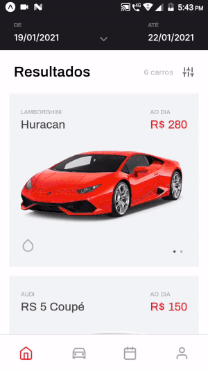

# RentX Mobile

RentX Mobile is a car rental application designed for convenient vehicle booking and management from your mobile device.

## Layout

You can view the full design of the application on Figma [here](https://www.figma.com/file/7Ro0D8mdcX36qWnSBhWaXF/RentX?node-id=0%3A1).

## Features

- **Choose Rental Period**  
  <p align="center">
    
  </p>

- **Select Your Car**  
  <p align="center">
    
  </p>

- **Splash Screen**  
  <p align="center">
    
  </p>

## Technologies Used

The application is built using the following technologies:
- JavaScript
- TypeScript
- React Native
- Expo
- React Navigation
- Styled Components
- Axios
- Yup
- Date-fns

## How to Run

To run the application, follow these steps:

### 1. Set Up Your Environment

Ensure you have [Node.js](https://nodejs.org/) and [Expo CLI](https://docs.expo.dev/get-started/installation/) installed.

### 2. Install Dependencies

Navigate to the project directory and install the required dependencies:

```bash
cd rentx-mobile
npm install
```

### 3. Start the Application

You can start the application in different environments:

- **Start the development server:**

  ```bash
  npm start
  ```

- **Run on Android device/emulator:**

  ```bash
  npm run android
  ```

- **Run on iOS device/emulator:**

  ```bash
  npm run ios
  ```

- **Run on web browser:**

  ```bash
  npm run web
  ```

## Getting Help

For more information or support, please refer to the official [Expo documentation](https://docs.expo.dev/) or [React Native documentation](https://reactnative.dev/docs/getting-started).
