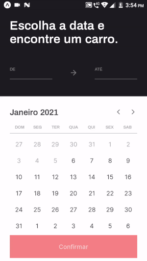

### Layout da aplicação
Acesse o arquivo no Figma com todas as páginas do app [aqui](https://www.figma.com/file/7Ro0D8mdcX36qWnSBhWaXF/RentX?node-id=0%3A1).

### :computer: Funcionalidades
- [x] Escolha o período do aluguel

- [x] Escolha seu carro

- [x] Splash Screen

